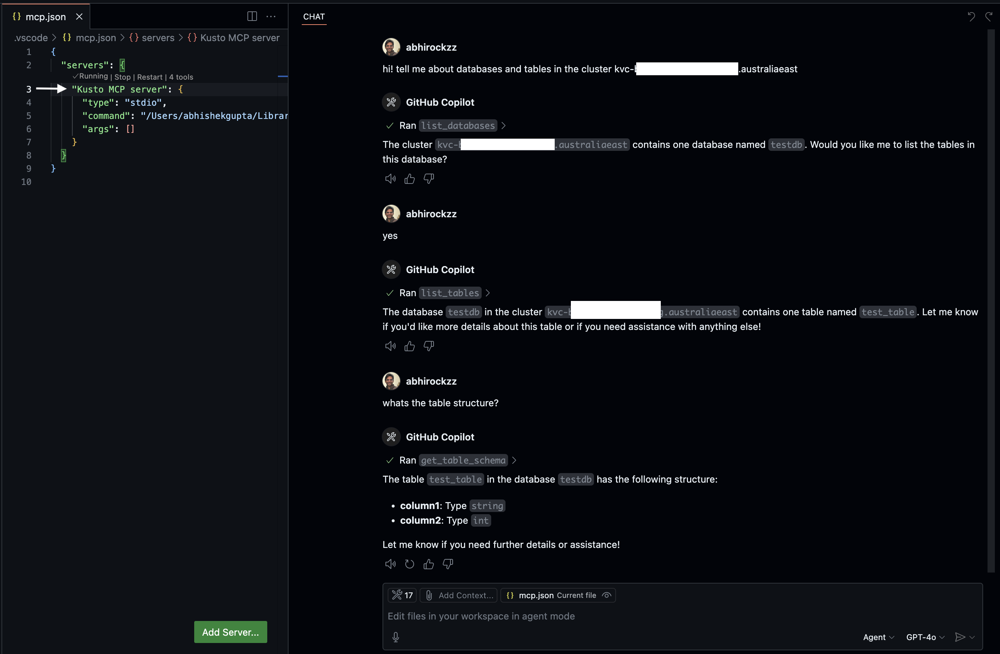

# Vibe querying with MCP server for Azure Data Explorer (Kusto)

This is an implementation of an MCP server for Azure Data Explorer (Kusto) built using its [Go SDK](https://github.com/Azure/azure-kusto-go). You can use this with [VS Code](https://code.visualstudio.com/blogs/2025/02/24/introducing-copilot-agent-mode) (or other MCP tools) for making data analysis and exploration easier.

It exposes tools for interacting with Azure Data Explorer:

1. **list_databases** - Lists all databases in a specific Azure Data Explorer cluster.
2. **list_tables** - Lists all tables in a specific Azure Data Explorer database.
3. **get_table_schema** - Gets the schema of a specific table in an Azure Data Explorer database.
4. **execute_query** - Executes a read-only KQL query against a database.

> Word(s) of caution: As much as I want folks to benefit from this, I have to call out that Large Language Models (LLMs) are non-deterministic by nature and can make mistakes. I would recommend you to **always validate** the results before making any decisions based on them. As far as the queries are concerned (based on the `execute_query` tool response), unless absolutely sure, **do not** execute them directly in your cluster.

Here is a sneak peek:



## How to run

```bash
git clone https://github.com/abhirockzz/mcp_kusto
cd mcp_kusto

go build -o mcp_kusto main.go
```

### Configure the MCP server

This will differ based on the MCP client/tool you use. For VS Code you can [follow these instructions](https://code.visualstudio.com/docs/copilot/chat/mcp-servers#_add-an-mcp-server) on how to configure this server using a `mcp.json` file. 

Here is an example of the [mcp.json file](mcp.json):

```json
{
  "servers": {
    "Kusto MCP server": {
      "type": "stdio",
      "command": "enter path to binary e.g. /Users/demo/Desktop/mcp_kusto",
      "args": []
    },
    //other MCP servers...
  }
}
```

```json
{
  "mcpServers": {
    "Kusto MCP server": {
      "command": "enter path to binary e.g. /Users/demo/Desktop/mcp_kusto",
      "args": []
    },
    //other MCP servers...
  }
}
```


### Authentication

- The user principal you use should have permissions required for `.show databases`, `.show table`, `.show tables`, and execute queries on the database. Refer to the documentation for [Azure Data Explorer](https://learn.microsoft.com/en-us/kusto/management/security-roles?view=azure-data-explorer) for more details.

- Authentication (Local credentials) - To keep things secure and simple, the MCP server uses [DefaultAzureCredential](https://learn.microsoft.com/en-us/azure/developer/go/sdk/authentication/credential-chains#defaultazurecredential-overview). This approach looks in the environment variables for an application service principal or at locally installed developer tools, such as the Azure CLI, for a set of developer credentials. Either approach can be used to authenticate the MCP server to Azure Data Explorer. For example, just login locally using Azure CLI ([az login](https://learn.microsoft.com/en-us/cli/azure/authenticate-azure-cli)).

You are good to go! Now spin up VS Code, Claude Desktop, or any other MCP tool and start vibe querying your Azure Data Explorer (Kusto) cluster!

## Local dev/testing

Start with [MCP inspector](https://modelcontextprotocol.io/docs/tools/inspector) - `npx @modelcontextprotocol/inspector ./mcp_kusto`
